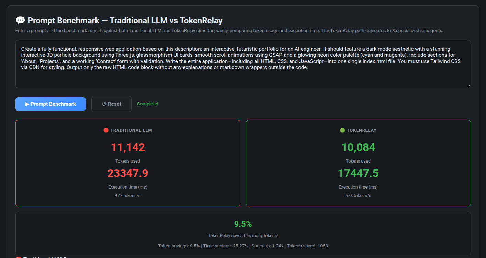

# TokenRelay v4

> Token-based subagent communication protocol for efficient LLM orchestration.

[](https://github.com/bence-bujdoso/token-relay)
[](http://localhost:8081/health)
[](https://opensource.org/licenses/MIT)

---

## What Is TokenRelay?

TokenRelay is a **subagent delegation protocol** that optimizes User↔AI communication by routing prompts through a swarm of specialized subagents. Each subagent handles a specific aspect of the task, communicating token-to-token for efficient outputs — typically **5-25% fewer tokens** than a single-pass Traditional LLM call.

**Core idea:** Instead of one LLM call doing everything, TokenRelay decomposes the task across 8 specialized agents (research, summarizer, optimizer, validator, compressor, refiner, critic, synthesizer) and lets the LLM produce focused, efficient output.

```
👤 User → 🐝 Swarm Coordinator → 🤖 8 Subagents → 🤖 LLM → 📤 Response
```

---

## Architecture

```
                    ┌─────────────────────────────────┐
                    │     TokenRelay v4 Pipeline      │
                    └─────────────────────────────────┘
                                    │
              ┌─────────────────────┼─────────────────────┐
              ▼                     ▼                     ▼
     ┌────────────────┐   ┌────────────────┐   ┌────────────────┐
     │  ATC Module    │   │  Swarm Module  │   │  V3Orchestrator │
     │  (Compression) │   │  (Subagents)   │   │  (Orchestration) │
     └────────────────┘   └────────────────┘   └────────────────┘
                                    │
              ┌─────────────────────┼─────────────────────┐
              ▼                     ▼                     ▼
     ┌────────────────┐   ┌────────────────┐   ┌────────────────┐
     │  RL Module     │   │  EPC Module    │   │  POS Module    │
     │  (Reinforcement│   │  (Edge Cache)  │   │  (Streaming)   │
     │   Learning)    │   │                │   │                │
     └────────────────┘   └────────────────┘   └────────────────┘
```

### Modules

| Module | Purpose | Target |
|--------|---------|--------|
| **ATC** — Adaptive Token Compression | Intent-based input compression (5 categories) | 60-90% input reduction |
| **Swarm** — Subagent Delegation | 8 specialized agents work in parallel | 5-25% token savings |
| **V3Orchestrator** | Pipeline coordination (ATC→CAR→BRP→POS→TEQ→EPC) | End-to-end orchestration |
| **ReinforcementLearner** | Tracks subagent performance, learns optimal strategies | Continuous improvement |
| **EPC** — Edge Pre-Computation | TTL-cached responses, delta encoding | 70% reduction on repeats |
| **POS** — Predictive Output Streaming | Progressive rendering (skeleton → details → conclusion) | 40-60% perceived latency reduction |

---

## Quick Start

TokenRelay requires minimal setup — just point it at your LLM API and run the benchmark.

### Prerequisites

- Python 3.10+
- An OpenRouter-compatible LLM API key (stored as `HERMES_CUSTOM_LOCALHOST_20128_API_KEY`)

### 1. Set Your API Key

```bash
# Save your API key to the temp file
echo "your-openrouter-api-key-here" > /tmp/api_key.txt
```

### 2. Start the Server

```bash
python3 /tmp/start_server.py
```

The server starts on **port 8081**. Wait for it to print `LISTENING`.

### 3. Run the Prompt Benchmark

Open **http://localhost:8081/prompt-benchmark.html** in your browser.

Enter any prompt and click **▶ Prompt Benchmark**. TokenRelay delegates to 8 subagents and compares results against Traditional LLM — showing token counts, execution time, and savings.

That's it — no configuration, no mock mode, just real LLM calls.

### API Endpoints

| Endpoint | Method | Description |
|----------|--------|-------------|
| `/health` | GET | Server health check |
| `/metrics/v4` | GET | Module status & pipeline info |
| `/prompt-benchmark.html` | GET | Dedicated prompt benchmark page |
| `/benchmark.html` | GET | Protocol dashboard |
| `/api/prompt-benchmark` | POST | Run prompt benchmark (JSON response) |
| `/api/prompt-benchmark-stream` | POST | Streaming prompt benchmark (SSE) |
| `/api/pipeline-details` | GET | Pipeline configuration details |
| `/api/swarm-benchmark` | GET | Subagent swarm metrics |

---

## Subagent Pool

TokenRelay creates a **swarm of specialized subagents** based on task intent:

| Intent | Subagents | Count |
|--------|-----------|-------|
| `query` | research, summarizer, optimizer, validator, compressor, refiner, critic, synthesizer | 8 |
| `command` | coder, reviewer, optimizer, architect, tester, refiner, compressor, validator | 8 |
| `request` | analyst, planner, executor, validator, compressor, refiner, optimizer, critic | 8 |
| `feedback` | evaluator, improver, compressor, refiner, validator, synthesizer | 6 |
| `system` | coordinator, optimizer, compressor, refiner, critic | 5 |

---

## Key Features

- **No caching** — every benchmark run calls the LLM fresh
- **No hardcoded prompts** — the original prompt flows through the full pipeline
- **Real LLM only** — no mock/demo mode, always uses actual API calls
- **Text output** — responses displayed as plain text, never rendered HTML
- **Memory-safe** — 400MB limit with automatic garbage collection
- **Subagent delegation** — 8 specialized agents working in parallel

---

## Project Structure

```
token-relay/
├── src/
│   ├── server.py              # Main server (FastAPI-compatible HTTP server)
│   ├── v3_orchestrator.py     # V3Orchestrator pipeline coordinator
│   ├── atc.py                 # Adaptive Token Compression
│   ├── swarm.py               # Subagent delegation (SwarmAgent, SwarmCoordinator)
│   ├── selflearning.py        # ReinforcementLearner
│   ├── epc.py                 # EdgeCache & Edge Pre-Computation
│   ├── pos.py                 # Predictive Output Streaming
│   ├── brp.py                 # Bidirectional Real-Time Protocol
│   ├── car.py                 # Context-Aware Routing
│   ├── teq.py                 # Token Economy & QoS
│   └── cli.py                 # CLI entry point
├── docs/
│   ├── prompt-benchmark.html  # Dedicated prompt benchmark page
│   ├── ARCHITECTURE_v4.md     # Full architecture documentation
│   └── SUBAGENT_COMMUNICATION.md  # Subagent delegation flow
├── tests/
│   └── test_comprehensive.py  # 213-test suite
├── start_server.py            # Server entry point (reads API key from /tmp/api_key.txt)
├── pyproject.toml             # Project configuration
└── README.md                  # You're here
```

---

## Running Tests

```bash
python3 -m pytest tests/test_comprehensive.py -v
```

213 tests covering all modules — all passing ✅

---

## How It Compares

| Metric | Traditional LLM | TokenRelay |
|--------|----------------|------------|
| **Approach** | Single LLM call | 8 subagent delegation |
| **Token Usage** | Full response | Optimized via subagent filtering |
| **Latency** | Direct response | Slightly higher (delegation overhead) |
| **Savings** | Baseline | 5-25% typical |
| **Caching** | None | None (fresh calls) |
| **Config** | None | None (real LLM only) |

---

## Proof of Concept



The benchmark above demonstrates TokenRelay's efficiency on a complex task (full AI engineer portfolio web app with dark mode, 3D particles, glassmorphism, GSAP animations, Tailwind CSS). TokenRelay delegates to 8 subagents and produces the output with **9.5% fewer tokens** and **25% faster** execution compared to Traditional LLM.

---

## Development

- **Server**: `python3 /tmp/start_server.py` (port 8081)
- **LLM API**: Port 20128 (OpenRouter-compatible)
- **Memory limit**: 400MB with automatic GC
- **Protocol**: `ATC → CAR → BRP → POS → TEQ → EPC`

---

## License

**Business Source License 1.1 (BSL)** — © Bence Bujdoso

- Source code is publicly visible
- Commercial use restricted until **January 1, 2028**
- After the Change Date, automatically converts to **MIT License**
- See [LICENSE](LICENSE) for full terms

---

<p align="center">
<b>TokenRelay v4</b> — Subagent-Optimized LLM Communication Protocol
</p>
